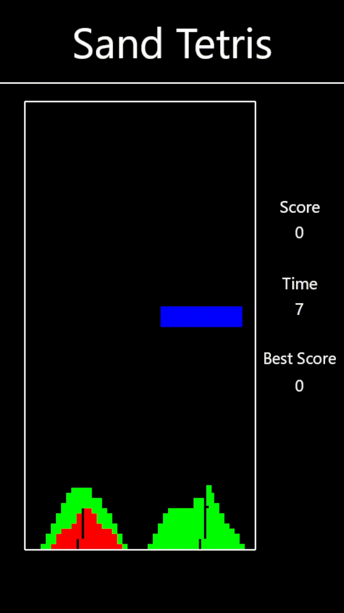
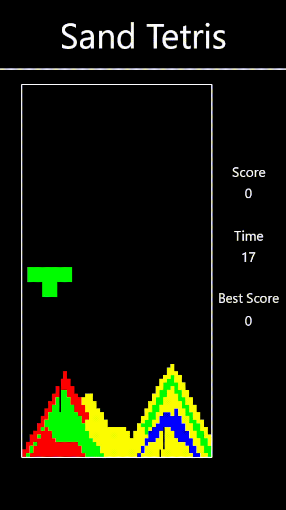

# 🤖 Sand Tetris RL 🤖
Reinforcement Learning meets falling sand physics — an AI agent learns to play a custom-built Sand Tetris using **PPO** architectures.


---

## Demo

The AI agent learns to play Sand Tetris in different difficulty modes.

| Easy Version | Hard Version |
|-------------|-------------|
|  |  |

---

## Getting Started

### Dependencies

- **Python**: 3.13.2
- **wandb**: 0.19.7
- **stable-baselines3**: 2.5.0
- **pyglet**: 2.1.9

### 1. Clone the repository
```bash
git clone https://github.com/core-not-dumped/Sand-Tetris-RL.git
cd Sand-Tetris-RL
```
### 2. Training
```bash
python main.py
```
### 3. Testing / Evaluation
```bash
python test/test_model.py
```

### Notes
- Ensure wandb.login() is done once before running the scripts.

## License
This project is licensed under the MIT License - see the [LICENSE](LICENSE.txt) file for details.
